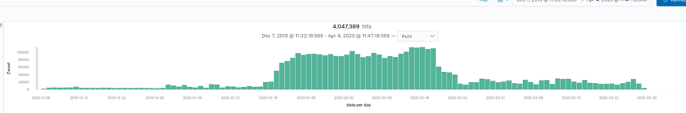
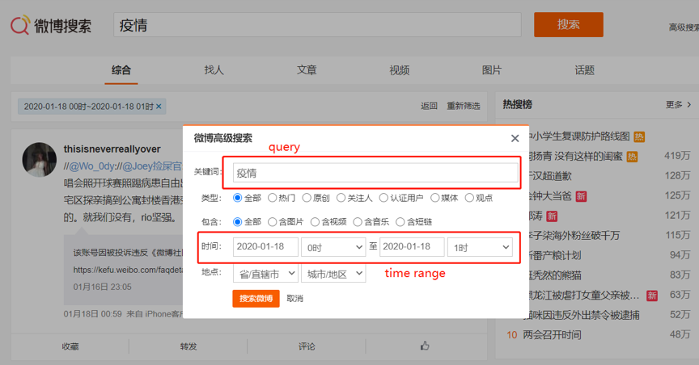
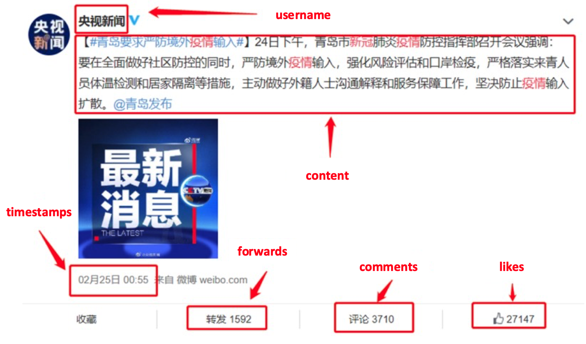
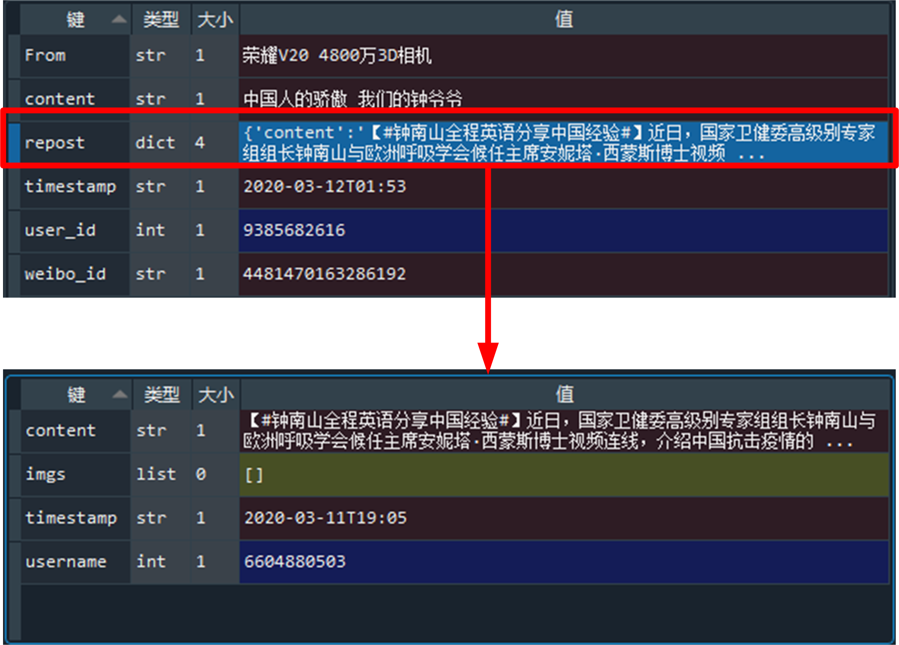

# Weibo COVID dataset

Sina Weibo (新浪微博), commonly referred to as "Chinese Twitter",  is a micro-blogging site. This Weibo dataset was used in [Analysis of misinformation during the COVID-19 outbreak in China: cultural, social and political entanglements](https://www.computer.org/csdl/journal/bd/5555/01/09340553/1qMJJIm92rm). The data was crawled on the Weibo platform from December 7, 2019, to April 4, 2020.

The data is crawled in two phases, covering a total of 4,047,389 Weibo posts. The first crawler ran on February 26, 2020, and collected 3.3 million Weibo posts from January 18, 2020, to February 26, 2020. The second crawler ran on April 4, crawling from December 7, 2020, to April 4, 2020, to complement the original dataset. The temporal distribution of the Weibo data is shown in Figure 1.



*Figure 1. Weibo data temporal distribution*

## How to acquire the dataset
This Weibo data was collected for and can only be used for research purposes. Please complete [google form](https://docs.google.com/forms/d/e/1FAIpQLSdxk9tb6tXsDA7FyCCDBkOmAZD3mf8dz_xm2huB-_lS3Yelng/viewform?usp=pp_url) to acquire this corpus. We will email you the instructions to download the data. 

If you use this data in your research, please cite the following article. Please reach out to Yujia Zhai at yjzhai@tjnu.edu.cn for questions related to the data.  

Leng, Yan, Yujia Zhai, Shaojing Sun, Yifei Wu, Jordan Selzer, Sharon Strover, Julia Fensel, Alex Pentland, and Ying Ding. "Analysis of misinformation during the COVID-19 outbreak in China: cultural, social and political entanglements." arXiv preprint arXiv:2005.10414 (2020).

```
@ARTICLE {9340553,
author = {Y. Leng and Y. Zhai and S. Sun and Y. Wu and J. Selzer and S. Strover and H. Zhang and A. Chen and Y. Ding},
journal = {IEEE Transactions on Big Data},
title = {Misinformation during the COVID-19 outbreak in China: cultural, social and political entanglements},
year = {5555},
volume = {},
number = {01},
issn = {2332-7790},
pages = {1-1},
keywords = {covid-19;blogs;social networking (online);pandemics;media;urban areas;big data},
doi = {10.1109/TBDATA.2021.3055758},
publisher = {IEEE Computer Society},
address = {Los Alamitos, CA, USA},
month = {jan}
}

```

## Data collection method

The Weibo data is obtained by a python crawler. The crawler automatically uses Weibo's advanced search function for keyword indexing. 

The keywords we used included:
- COVID-19
- novel coronavirus(新型冠状病毒)
- corona(新冠)
- epidemics(疫情)
- novel pneumonia(新型肺炎)
- pneumonia in Wuhan(武汉+肺炎)

The crawler program automatically entered one of the keywords into the query box and set the query time range to be a specific hour. As illustrated in Figure 2, the crawler sets the time range from January 18, 2020, 00:00:00 to January 18, 2020, 01:00:00. 

For each query, the time range increased by one hour, and each query searched all the new posts within an hour. Each query returned a maximum of 50 pages, each contained around 20 posts. If the number posts exceed the page limits, we cannot fully collect the information due to the limitations of the search function. 



*Figure 2. Weibo's advanced search function for keyword indexing*

## Metadata of the Weibo data
We illustrate a weibo in Figure 3, which contains the user name, content, timestamp, number of reposts, comments, and likes. 


* Figure 3. A screenshot of one Weibo post *

We present the Weibo metadata in Table 1 and Figure 4. 

| Date field | Description|
|:------------ |:---------------:|
| weibo_id | the unique identifier of the weibo |
| user_id | the unique identifier for user |
| from | the type of the device sent this weibo |
| content | content of the weibo |
| timestamp | posting time | 
| repost | the original weibo reposted by this weibo, containing the content/timestamp/image/user_id. Note: not all weibo has this variable |


*Figure 4. Metadata of Weibo data*
